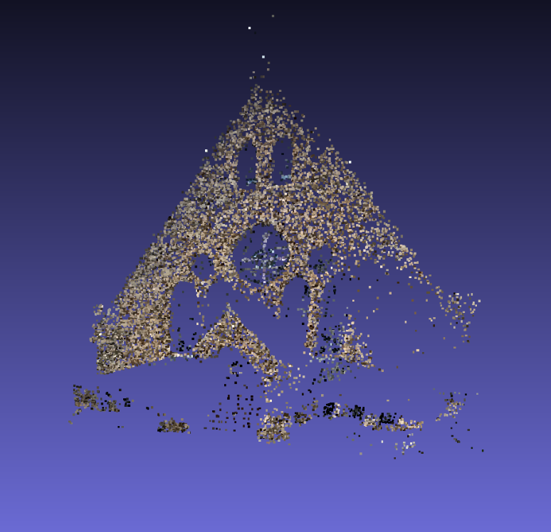
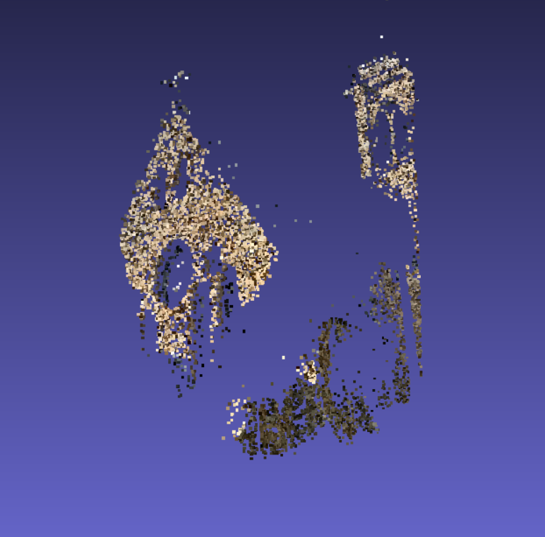

# Two-View SfM Pipeline

Sparse 3D reconstruction from an image pair using a classical Structure-from-Motion (SfM) pipeline in Python/OpenCV. Estimates relative pose from SIFT matches, chains poses into a shared frame, and triangulates a sparse 3D point cloud.

## Pipeline Visualization

<p float="left">
  
  
</p>


## Highlights
- SIFT keypoints & descriptors (OpenCV contrib), FLANN matching with Lowe’s ratio test  
- RANSAC-based F/E estimation; `recoverPose` for relative \(R, t\)  
- **Global pose chaining** (compose pairwise poses into global extrinsics)  
- Linear triangulation; writes colored `.ply` point cloud  
- JSON artifacts for reproducibility and downstream steps

## Pipeline
1. **Features & matches** → SIFT → FLANN (ratio test) → RANSAC pruning  
2. **Relative pose** → Essential matrix \(E\) → `recoverPose` → \(R_{\text{rel}}, t_{\text{rel}}\)  
3. **Global pose chaining** → compose pairwise \(R,t\) into world-frame extrinsics  
4. **Triangulation** → build sparse 3D points; write colored PLY

## Requirements
- Python 3.9+  
- OpenCV **contrib** (`opencv-contrib-python`)  
- NumPy

```bash
pip install opencv-contrib-python numpy
